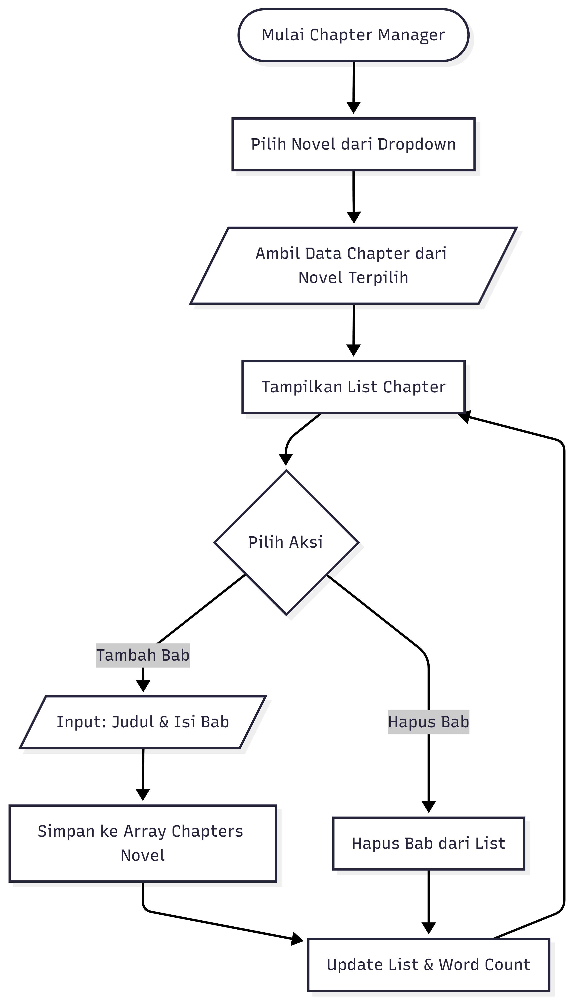

# 📚 NovelVerse — Platform Manajemen Novel

> Platform menulis dan manajemen novel berbasis web yang dibangun dengan HTML, CSS, dan JavaScript Vanilla. Dirancang dengan antarmuka elegan bertema gelap (dark-mode) untuk mendukung produktivitas penulis Indonesia.

---

## 📋 Daftar Isi

- [Deskripsi Proyek](#deskripsi-proyek)
- [Fitur Utama](#fitur-utama)
- [Teknologi yang Digunakan](#teknologi-yang-digunakan)
- [Struktur Proyek](#struktur-proyek)
- [Alur Program (Flowchart)](#alur-program-flowchart)
- [Pseudocode Logika Utama](#pseudocode-logika-utama)
- [Penjelasan Fitur & Implementasi](#penjelasan-fitur--implementasi)
- [Cara Menjalankan](#cara-menjalankan)
- [Struktur Data (LocalStorage)](#struktur-data-localstorage)
- [Konsep Pemrograman yang Diterapkan](#konsep-pemrograman-yang-diterapkan)
- [Tampilan Aplikasi](#tampilan-aplikasi)
- [Pengembang](#pengembang)

---

## 📖 Deskripsi Proyek

**NovelVerse** adalah aplikasi web single-page (SPA) yang memungkinkan penulis novel untuk:

- Mencatat dan mengelola koleksi novel mereka
- Menambahkan chapter pada setiap novel secara terstruktur
- Melacak statistik penulisan (jumlah novel, chapter, dan total kata)
- Mencari dan memfilter novel berdasarkan judul maupun genre

Semua data disimpan secara lokal di browser menggunakan **LocalStorage**, sehingga tidak memerlukan server atau koneksi internet untuk berjalan (kecuali untuk memuat font dari Google Fonts dan Tailwind CSS via CDN).

Proyek ini dibuat sebagai tugas mata kuliah **Pemrograman Web** dengan menerapkan konsep-konsep dasar JavaScript seperti manipulasi DOM, event handling, struktur kontrol (if/else, looping), dan manajemen state berbasis array of objects.

---

## ✨ Fitur Utama

| Fitur | Deskripsi |
|---|---|
| ➕ **Tambah Novel** | Menambahkan novel baru dengan judul, genre, status, dan sinopsis |
| ✏️ **Edit Novel** | Memperbarui data novel melalui modal edit |
| 🗑️ **Hapus Novel** | Menghapus novel beserta konfirmasi dialog |
| 🔍 **Cari & Filter** | Pencarian real-time berdasarkan judul dan filter berdasarkan genre |
| 📖 **Chapter Manager** | Menambah dan menghapus chapter per novel, dilengkapi pelacak jumlah kata |
| 📊 **Statistik** | Dashboard statistik: total novel, total chapter, total kata, dan novel aktif |
| 🔔 **Toast Notification** | Notifikasi sukses / error / peringatan yang muncul otomatis |
| 📱 **Responsif** | Layout adaptif untuk desktop dan perangkat mobile |
| 🌌 **Animated Background** | Background bintang beranimasi menggunakan HTML Canvas |

---

## 🛠️ Teknologi yang Digunakan

| Teknologi | Versi / Sumber | Fungsi |
|---|---|---|
| **HTML5** | Native | Struktur dan semantik halaman |
| **CSS3** | Native + Custom Properties | Styling, animasi, dan design token |
| **JavaScript (ES6+)** | Native (Vanilla JS) | Logika aplikasi, DOM manipulation, event handling |
| **Tailwind CSS** | CDN (latest) | Utility-class styling tambahan |
| **Google Fonts** | CDN | Cormorant Garamond, DM Sans, DM Mono |
| **LocalStorage API** | Browser Native | Persistensi data tanpa backend |
| **Canvas API** | Browser Native | Animasi latar belakang bintang |

---

## 📁 Struktur Proyek

```
novelverse/
│
├── novelverse-app.html     # File utama aplikasi (single-file architecture)
│
├── img/                    # Folder aset gambar
│   ├── flowchart1.png      # Flowchart: Alur Manajemen Novel (CRUD)
│   └── flowchart2.png      # Flowchart: Alur Chapter Manager
│
└── README.md               # Dokumentasi proyek ini
```

> **Catatan Arsitektur:** Proyek menggunakan pendekatan *single-file* — seluruh HTML, CSS, dan JavaScript terdapat dalam satu file `.html`. Pendekatan ini dipilih untuk kemudahan distribusi dan sesuai dengan kebutuhan tugas (tanpa framework atau bundler).

---

## 🔄 Alur Program (Flowchart)

### Flowchart 1 — Manajemen Novel (CRUD)

Flowchart berikut menggambarkan alur utama aplikasi dari inisialisasi hingga seluruh operasi CRUD (Create, Read, Update, Delete) pada data novel.


**Penjelasan Alur:**

1. Aplikasi dimulai dan fungsi `initApp()` dipanggil saat DOM siap
2. Data novel diambil dari **LocalStorage** (`nv_novels`)
3. List novel dan statistik di-*render* ke tampilan
4. Pengguna dapat memilih aksi:
   - **Cari Novel** → Filter data berdasarkan judul / genre secara real-time
   - **Tambah Novel** → Input form divalidasi, jika valid disimpan ke LocalStorage dan UI di-update
   - **Edit Novel** → Modal edit dibuka dengan data lama, perubahan disimpan setelah validasi
   - **Hapus Novel** → Modal konfirmasi ditampilkan, jika dikonfirmasi data dihapus dari array & LocalStorage
5. Setiap aksi berhasil memicu **Toast Notification** dan *re-render* list

---

### Flowchart 2 — Chapter Manager

Flowchart berikut menggambarkan alur pengelolaan chapter untuk setiap novel.



**Penjelasan Alur:**

1. Pengguna memilih novel dari dropdown selector
2. Data chapter diambil dan difilter berdasarkan `novelId` yang dipilih
3. List chapter ditampilkan beserta informasi judul, jumlah kata, dan tanggal
4. Pengguna dapat:
   - **Tambah Bab** → Input judul dan isi bab, disimpan ke array chapters, word count novel diperbarui
   - **Hapus Bab** → Chapter dihapus dari list, word count dikurangi secara otomatis
5. List dan statistik kata diperbarui (*re-render*)

---

## 💡 Pseudocode Logika Utama

### Inisialisasi Aplikasi

```
FUNGSI initApp():
    renderNovelList()        // Tampilkan semua novel dari LocalStorage
    updateStats()            // Hitung dan tampilkan statistik
    populateNovelSelect()    // Isi dropdown novel di Chapter Manager
    
    novels ← loadFromStorage('nv_novels')
    JIKA novels.length > 0 MAKA
        tampilkan toast "Selamat datang! {n} novel tersimpan."
    AKHIR JIKA
AKHIR FUNGSI
```

### Tambah Novel

```
FUNGSI addNovel():
    title    ← ambil nilai input #add-title
    genre    ← ambil nilai input #add-genre
    synopsis ← ambil nilai input #add-synopsis

    // Validasi input
    JIKA title kosong ATAU genre kosong ATAU synopsis kosong MAKA
        tampilkan pesan error pada field yang kosong
        tampilkan toast error
        KEMBALIKAN (hentikan fungsi)
    AKHIR JIKA

    // Buat objek novel baru
    novel ← {
        id:        generateId(),
        title:     title,
        genre:     genre,
        synopsis:  synopsis,
        status:    'Draft',
        wordCount: 0,
        createdAt: tanggal sekarang
    }

    novels ← loadFromStorage('nv_novels')
    novels.push(novel)
    saveToStorage('nv_novels', novels)

    resetForm()
    renderNovelList()
    updateStats()
    tampilkan toast sukses
AKHIR FUNGSI
```

### Edit Novel

```
FUNGSI saveEditNovel():
    id       ← ambil nilai #edit-novel-id (hidden input)
    title    ← ambil nilai #edit-title
    genre    ← ambil nilai #edit-genre
    status   ← ambil nilai #edit-status
    synopsis ← ambil nilai #edit-synopsis

    JIKA title kosong ATAU genre kosong ATAU synopsis kosong MAKA
        tampilkan error, KEMBALIKAN
    AKHIR JIKA

    novels ← loadFromStorage('nv_novels')
    idx    ← cari index novel dengan id === id

    JIKA idx ditemukan MAKA
        novels[idx].title    ← title
        novels[idx].genre    ← genre
        novels[idx].status   ← status
        novels[idx].synopsis ← synopsis
        saveToStorage('nv_novels', novels)
        tutup modal edit
        renderNovelList()
        updateStats()
        tampilkan toast sukses
    AKHIR JIKA
AKHIR FUNGSI
```

### Hapus Novel

```
FUNGSI deleteNovel(novelId):
    tampilkan modal konfirmasi hapus

FUNGSI confirmDeleteNovel():
    id      ← ambil nilai #delete-novel-id
    novels  ← loadFromStorage('nv_novels')
    novels  ← filter novels dimana novel.id TIDAK SAMA DENGAN id

    chapters ← loadFromStorage('nv_chapters')
    chapters ← filter chapters dimana chapter.novelId TIDAK SAMA DENGAN id

    saveToStorage('nv_novels', novels)
    saveToStorage('nv_chapters', chapters)

    tutup modal
    renderNovelList()
    updateStats()
    tampilkan toast peringatan
AKHIR FUNGSI
```

### Filter / Pencarian Novel

```
FUNGSI filterNovels():
    query    ← ambil nilai search input (huruf kecil semua)
    genre    ← ambil nilai filter genre
    novels   ← loadFromStorage('nv_novels')

    LOOPING setiap novel dalam novels:
        cocokJudul ← novel.title (huruf kecil) MENGANDUNG query
        cocokGenre ← genre kosong ATAU novel.genre === genre

        JIKA cocokJudul DAN cocokGenre MAKA
            tampilkan kartu novel ini
        LAIN:
            sembunyikan kartu novel ini
        AKHIR JIKA
    AKHIR LOOPING
AKHIR FUNGSI
```

---

## 🔬 Penjelasan Fitur & Implementasi

### 1. LocalStorage sebagai Database

Semua data persisten disimpan di browser menggunakan dua key:

```javascript
// Key yang digunakan:
'nv_novels'    // Array of novel objects
'nv_chapters'  // Array of chapter objects

// Helper functions:
function saveToStorage(key, data) {
    localStorage.setItem(key, JSON.stringify(data));
}

function loadFromStorage(key) {
    const raw = localStorage.getItem(key);
    return raw ? JSON.parse(raw) : []; // Default ke array kosong jika null
}
```

### 2. Generate ID Unik

```javascript
// Mengombinasikan timestamp + random string untuk ID yang unik
function generateId() {
    return Date.now().toString(36) + Math.random().toString(36).substr(2);
}
```

### 3. XSS Prevention

Semua input pengguna di-*escape* sebelum dimasukkan ke innerHTML untuk mencegah Cross-Site Scripting:

```javascript
function escapeHtml(str) {
    if (!str) return '';
    return str
        .replace(/&/g,  '&amp;')
        .replace(/</g,  '&lt;')
        .replace(/>/g,  '&gt;')
        .replace(/"/g,  '&quot;')
        .replace(/'/g, '&#039;');
}
```

### 4. Toast Notification System

```javascript
// Tipe yang tersedia: 'success', 'error', 'warning', 'info'
showToast('Novel berhasil ditambahkan!', 'success');
```

### 5. Tab Navigation (SPA Pattern)

```javascript
// Menampilkan satu halaman dan menyembunyikan sisanya
function showTab(name) {
    document.querySelectorAll('.page').forEach(p => p.classList.remove('active'));
    document.querySelectorAll('.tab-btn').forEach(b => b.classList.remove('active'));
    document.getElementById('page-' + name).classList.add('active');
    document.getElementById('tab-' + name).classList.add('active');
}
```

---

## ▶️ Cara Menjalankan

Karena NovelVerse adalah aplikasi single-file tanpa dependensi server, cara menjalankannya sangat mudah:

### Metode 1 — Buka Langsung di Browser

```
1. Download file novelverse-app.html
2. Double-click file tersebut
3. File akan terbuka di browser default Anda
4. Aplikasi siap digunakan!
```

### Metode 2 — Via Live Server (Rekomendasi untuk Development)

```
1. Buka folder proyek di VS Code
2. Install ekstensi "Live Server" (jika belum ada)
3. Klik kanan novelverse-app.html → "Open with Live Server"
4. Browser akan otomatis membuka aplikasi di localhost
```

> **Syarat:** Browser modern yang mendukung ES6+, LocalStorage API, dan Canvas API (Chrome, Firefox, Edge, Safari versi terbaru).

---

## 🗄️ Struktur Data (LocalStorage)

### Skema Novel Object

```json
{
  "id":        "lp3k2abc123",
  "title":     "Bayangan di Ujung Senja",
  "genre":     "Romance",
  "synopsis":  "Kisah dua jiwa yang bertemu di antara waktu...",
  "status":    "Ongoing",
  "wordCount": 12500,
  "createdAt": "2026-05-11T05:30:00.000Z"
}
```

**Opsi Status Novel:**

| Status | Keterangan |
|---|---|
| `Draft` | Novel baru dibuat, belum aktif ditulis |
| `Ongoing` | Sedang dalam proses penulisan |
| `Completed` | Novel telah selesai ditulis |
| `Hiatus` | Penulisan sementara dihentikan |

**Opsi Genre:**
`Romance` · `Fantasy` · `Thriller` · `Mystery` · `Horror` · `Sci-Fi` · `Historical` · `Literary Fiction`

---

### Skema Chapter Object

```json
{
  "id":        "mc9x5def456",
  "novelId":   "lp3k2abc123",
  "number":    1,
  "title":     "Pertemuan di Stasiun Tua",
  "wordCount": 3200,
  "notes":     "Perkenalan tokoh utama",
  "status":    "Draft",
  "createdAt": "2026-05-11T06:00:00.000Z"
}
```

> **Relasi Data:** Setiap chapter memiliki `novelId` yang merujuk ke `id` dari novel induknya (pola one-to-many). Ketika sebuah novel dihapus, seluruh chapter dengan `novelId` yang sama juga dihapus secara otomatis.

---

## 🧩 Konsep Pemrograman yang Diterapkan

| Konsep | Implementasi dalam Proyek |
|---|---|
| **Variabel & Tipe Data** | String (judul, genre), Number (wordCount), Boolean, Array, Object |
| **Struktur Kontrol IF/ELSE** | Validasi form input, cek data kosong, kondisi render |
| **Looping (forEach, filter)** | Render daftar novel, filter pencarian, hitung statistik |
| **Fungsi** | Modular: `addNovel()`, `editNovel()`, `deleteNovel()`, `renderNovelList()`, dll. |
| **Array Methods** | `.push()`, `.filter()`, `.findIndex()`, `.forEach()`, `.some()` |
| **DOM Manipulation** | `getElementById`, `innerHTML`, `classList`, `querySelector` |
| **Event Handling** | `onclick`, `oninput`, `addEventListener('DOMContentLoaded')` |
| **LocalStorage** | `setItem()`, `getItem()` dengan serialisasi JSON |
| **Template Literals** | Pembuatan HTML dinamis menggunakan backtick string |
| **XSS Prevention** | Fungsi `escapeHtml()` pada setiap output user input |
| **CSS Custom Properties** | Design token system menggunakan variabel CSS (`:root`) |
| **Responsive Design** | Media queries untuk breakpoint mobile dan tablet |
| **Canvas API** | Animasi bintang pada background menggunakan `requestAnimationFrame` |

---

## 📸 Tampilan Aplikasi

| Halaman | Deskripsi |
|---|---|
| **🏠 Beranda** | Landing page dengan hero section, statistik, dan daftar fitur |
| **📚 Manajemen Novel** | Form tambah novel, grid kartu novel, filter dan pencarian |
| **📖 Chapter Manager** | Dropdown pemilih novel, form tambah chapter, list chapter |
| **📊 Flowchart** | Visualisasi alur program berbasis flowchart interaktif |
| **💻 Pseudocode** | Tampilan pseudocode dari setiap fungsi utama |

---

## 👨‍💻 Pengembang

| Atribut | Detail |
|---|---|
| **Nama** | Fahri |
| **Program Studi** | Information Technology |
| **Universitas** | Universitas Amikom Purwokerto |
| **Mata Kuliah** | Pemrograman Web |
| **Tahun Akademik** | 2025/2026 |

---

## 📄 Lisensi

Proyek ini dibuat untuk keperluan akademik. Seluruh kode merupakan hasil karya sendiri dan bebas digunakan untuk pembelajaran.

---

<div align="center">
  <sub>Dibuat dengan ❤️ menggunakan HTML, CSS & Vanilla JavaScript</sub>
</div>
